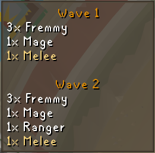
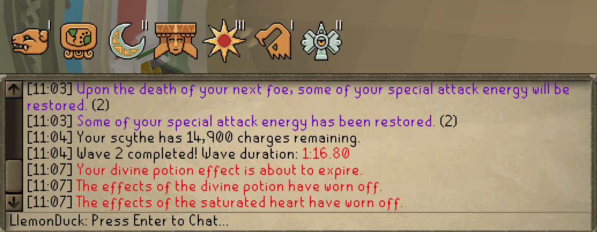
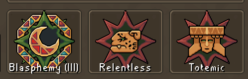
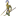
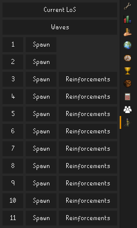
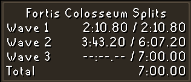
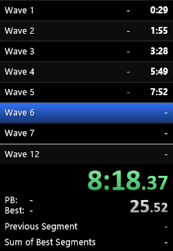
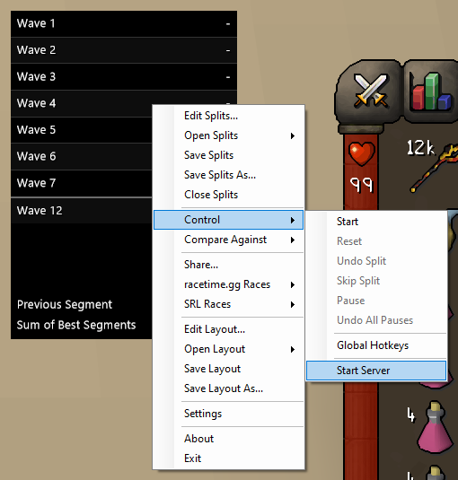

# Fortis Colosseum

Utilities and information for the Fortis Colosseum challenge gauntlet.


[](https://runelite.net/plugin-hub/show/fortis-colosseum)
[](https://runelite.net/plugin-hub/show/fortis-colosseum)

## Features

<details>
<summary>Waves Overlay</summary>

Shows the current and/or next wave spawns in an on-screen overlay.


</details>

<details>
<summary>Modifiers</summary>

Shows an overlay of the currently active modifiers above the chatbox,
similar to Leagues style relics.
This overlay can be flipped and/or changed to a more fancy display
by shift+right-clicking the overlay, or via the config options.



The plugin can also add names to the options on the between-wave selector.



</details>

<details>
<summary>Loot Interface</summary>

* **Left-Click Bank-All**:
  Swaps the two-click bank all to a single-click bank all in the loot chest interface.
* **Hide Next Wave**:
  Hides the potential next-wave loot on the between-wave interface,
  either on all waves or just for wave 12.
  This can be useful to reduce the stress of seeing a valuable item appear.
* **Show Loot Total**:
  Shows the total earned or potential (or both) loot value on the between-wave interface,
  without requiring switching to the vanilla "Loot" tab.
</details>

<details>
<summary>LoS Links Panel</summary>

Generates links to the line of sight tool [https://los.colosim.com/](https://los.colosim.com/)
for initial wave spawns, reinforcements, and current player & NPC positions.

Access the feature by clicking on the side panel icon:



For each initial wave and reinforcements spawn, the plugin adds a button that opens up the
correct los.colosim.com URL with every NPC location loaded in. These buttons persist even
after you leave the Colosseum, until you start wave 1 again.

During a wave, you can also click "Current LoS" to get a LoS link with every NPC's current
location. Perfect for asking pillar stack questions on Discord!


</details>

<details>
<summary>Splits</summary>

Shows an overlay of splits timings with either per-wave time or cumulative wave-end time.



Alternatively, the splits can be written to a file using the "Save to File" config option.
The file is named as timestamp of the run ending, and the format is:
```
Wave 1: ticksInWave / ticksSinceRunStart
Wave 2: ticksInWave / ticksSinceRunStart
...
```

The plugin can also interface with LiveSplit to automatically split at the end of each wave.
This requires the [LiveSplit Server](https://github.com/LiveSplit/LiveSplit.Server) component
(which is built-in as of LiveSplit 1.8.29).



You can use the [layout file](/docs/livesplit/Fortis%20Colosseum.lsl)
and [splits file](/docs/livesplit/Old%20School%20RuneScape%20-%20Fortis%20Colosseum.lss)
provided in this repository as a starting point.

You MUST select "Start Server" to receive times.
This is required EVERY TIME you begin LiveSplit.



</details>
